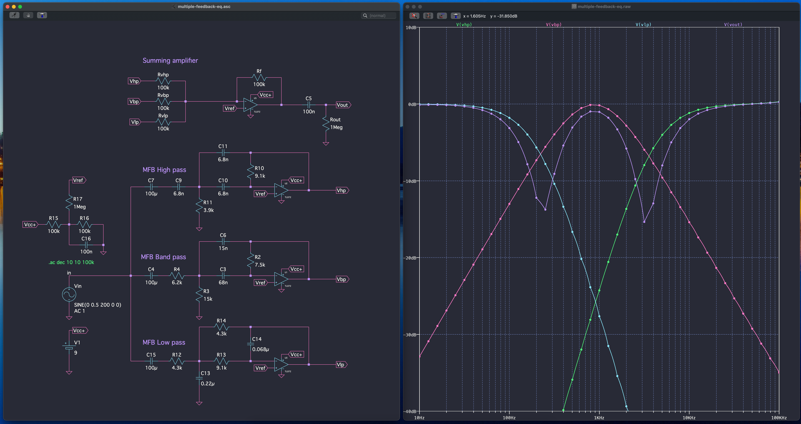

# Analog Pedal Equalizer
I am currently trying to design an analog EQ pedal for guitar.

## Simulation
This (below) is the current state of the simulated circuit, using three MFG types active filters. LTSpice files are under `./simulation` folder.  
Op-amps are TL072. I plan to use a 9V single-supply, so I have to bring a Vref of 4.5V via a voltage divider on the non-inverting input. I then use a summing amplifier on last stage, the goal being to have variable resistors for `Rv*` in order to EQ the input signal.

  

 I tried Sallen-Key solutions but the low pass requires a 3rd order in order to avoid the high frequency leak, I don't like that.

## Hardware
Parts are on the way. Soon tm.
